<!-- ===================== HERO SECTION ===================== -->

<h1 align="center">🚗 RK Motors – AI Powered Car Marketplace</h1>

  

  
  
  
  
  
  

---

## 📌 Project Overview

**RK Motors** is an **AI-powered car marketplace** built to simplify the car buying journey by providing  
**smart search**, **advanced filtering**, and **online test-drive scheduling** on a single platform.

This project was inspired by a **real-world problem** where users repeatedly struggle to search, compare, and coordinate car details with dealers.  
The platform focuses on **performance, scalability, and real-world usability**, making it suitable for modern automobile services.

## 🚀 Key Features

### 🔍 Smart Car Discovery
- Filter cars by **fuel type**, **body type**, **model**, and more  
- Quick and accurate search results  

### 📅 Test Drive Scheduling
- Users can book test drives by selecting **date and time**
- Reduces manual coordination with dealers  

### 🔐 Authentication & Security
- Secure authentication using **Clerk**
- API protection and rate limiting using **Arcjet**

### ⚙️ Backend & Data Management
- REST APIs built using **Next.js + Express.js**
- **Prisma ORM** for type-safe database access
- **Supabase** as a scalable cloud database

### 🤖 AI Integration
- **Gemini API** used for intelligent API-based features and enhancements

---

## 🛠️ Tech Stack

### Frontend
- React.js  
- Responsive UI with modern design principles 

### Backend
- Next.js  
- Node.js  
- Express.js  

### Database & ORM
- Supabase  
- Prisma ORM  

### Authentication & Security
- Clerk Authentication  
- Arcjet Security (Rate limiting & security) 

### APIs
- Gemini API  

---

## 📈 Impact on Users

- ⏱️ Reduces time spent on searching and booking test drives  
- 🎯 Improves decision-making with smart filters  
- 📱 Smooth, responsive, and user-friendly interface  
- 🔒 Secure access with modern authentication and security practices  

---

## 🎯 What I Learned

- Building a **production-style full-stack application**
- Integrating modern authentication and security tools
- Working with **Prisma ORM & Supabase**
- Designing scalable backend architecture

---

## 🔮 Future Scope

- AI-based car recommendations  
- Cloud deployment and scaling  
- Mobile app version  
- Integration with real dealership systems  

---

## 📸 Application Snapshots

### 🏠 Home Page
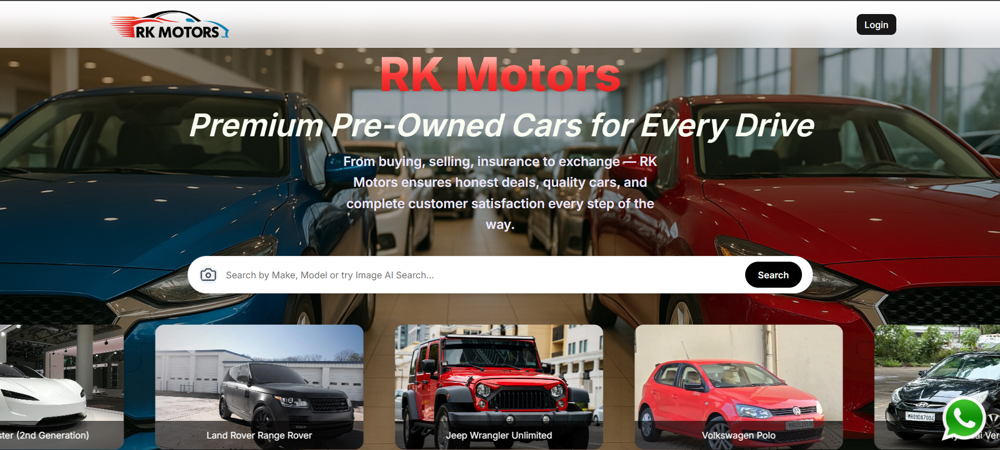

### 🔍 Browse Cars & Filters
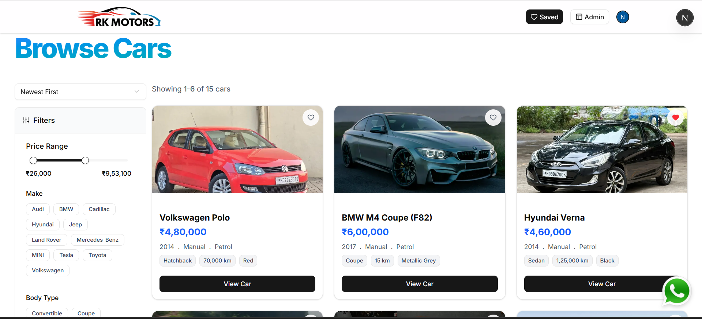

### 🚘 Car Details & EMI Calculator
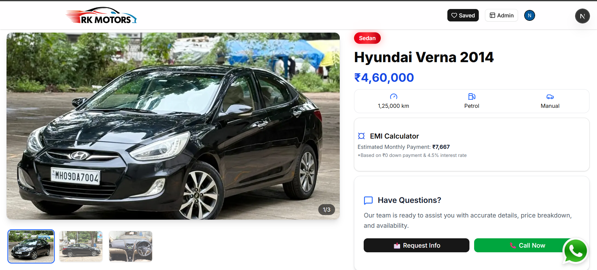

### ⭐ Featured Cars
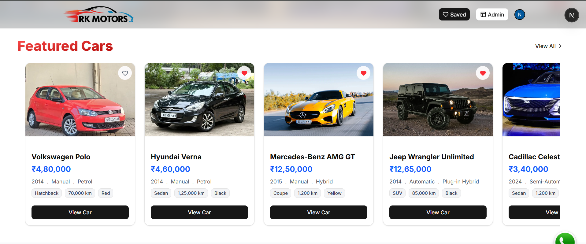

### ❓ Frequently Asked Questions
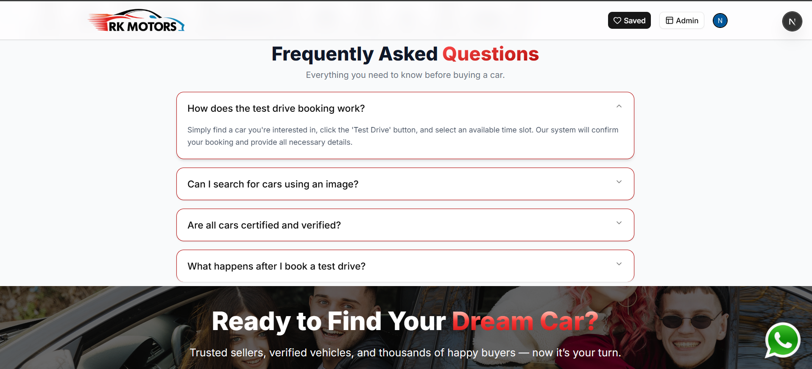

### 🤖 Image-Based AI Car Search
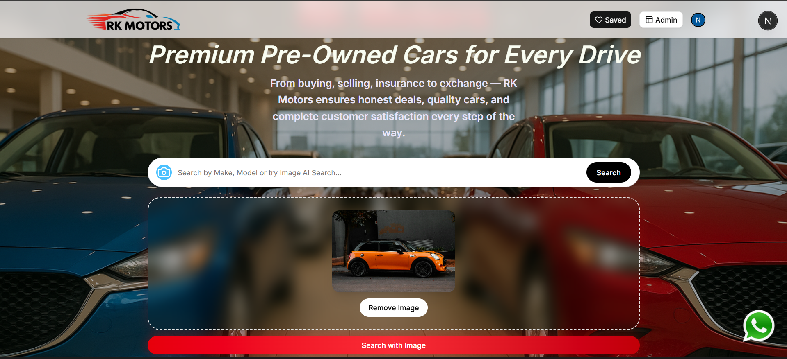

### 🔐 Authentication (Clerk)
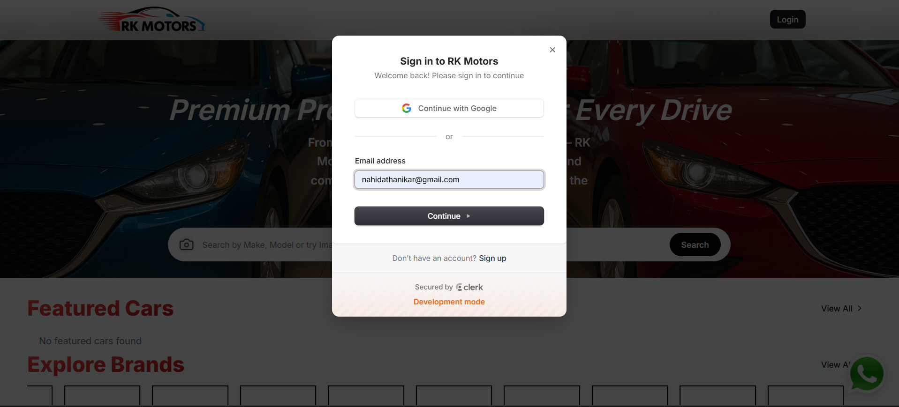

---

## 🛠️ Admin Panel

### 📊 Admin Dashboard
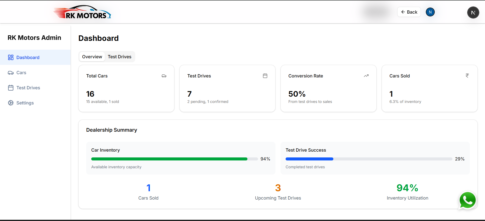

### 🚗 Cars Management
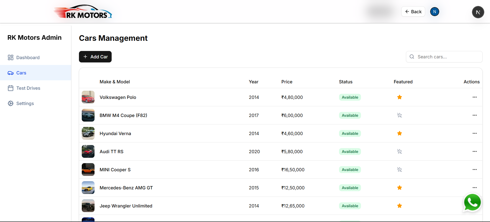

### Add car detail 
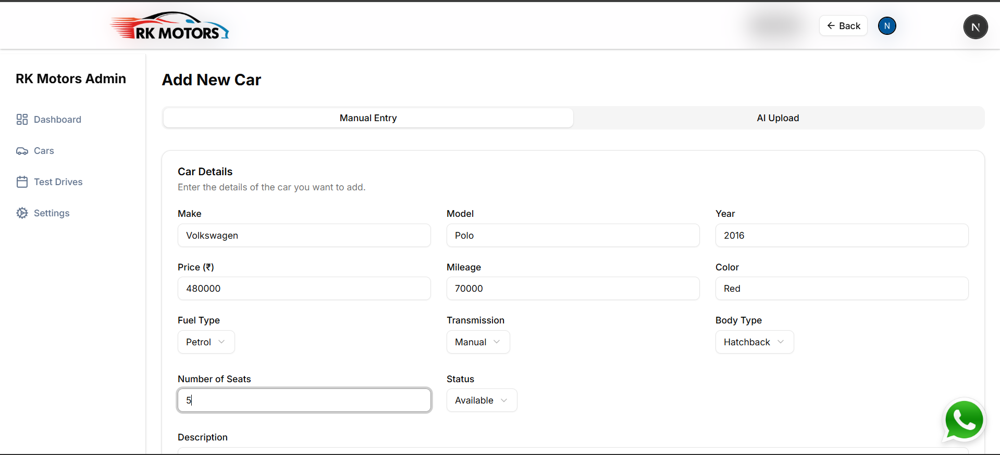

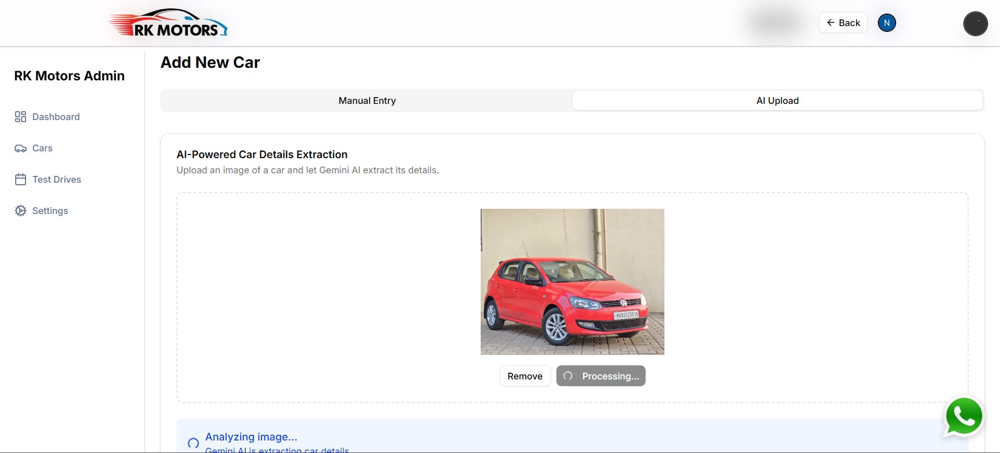

### 📅 Test Drive Management
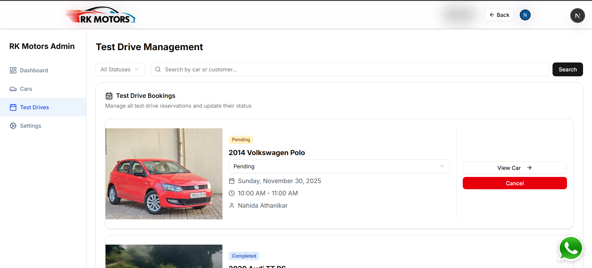

---

## 🌍 Live Demo & Repository

- 🔗 **Live Project:**  https://rk-motors-blond.vercel.app/
- 📦 **GitHub Repository:** [https://github.com/nahida-athanikar/rk-motors] 

---

## 🤝 Connect With Me

If you like this project or have suggestions, feel free to connect.  
 

⭐ If you find this project helpful, don’t forget to star the repository!

